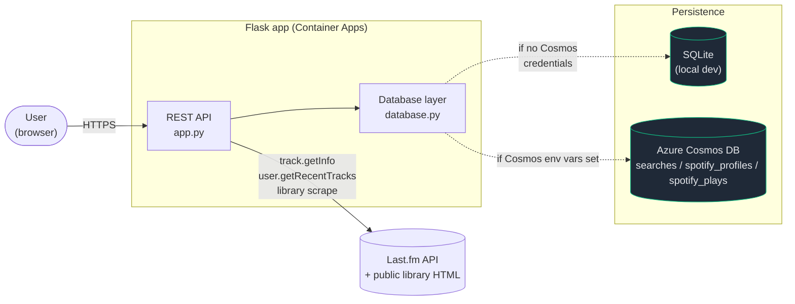
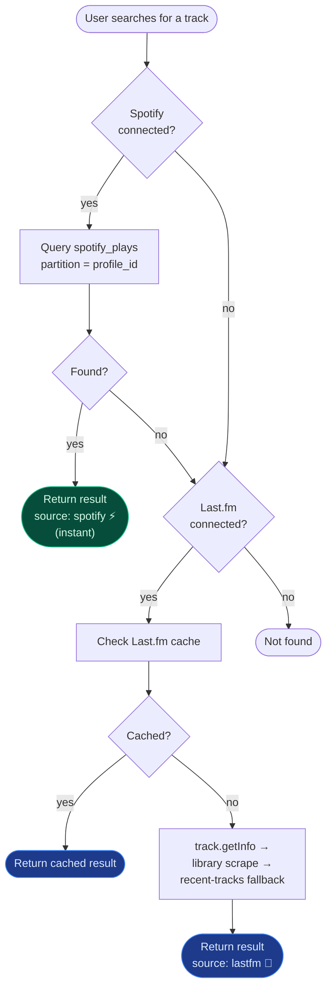
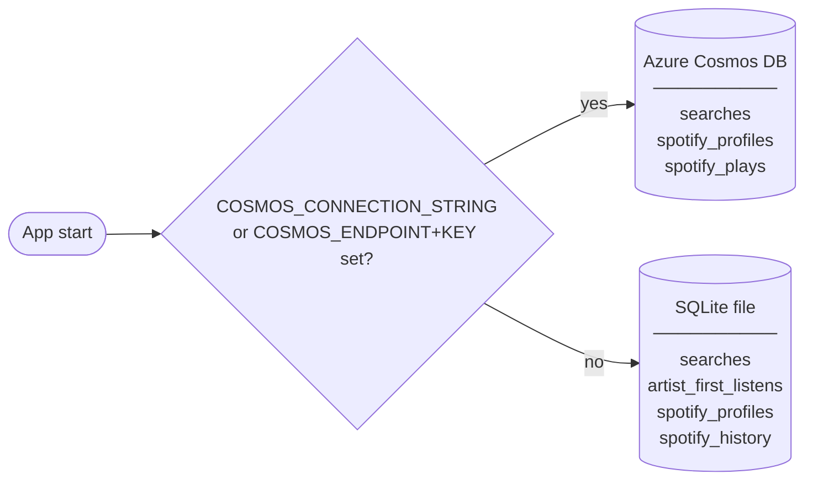
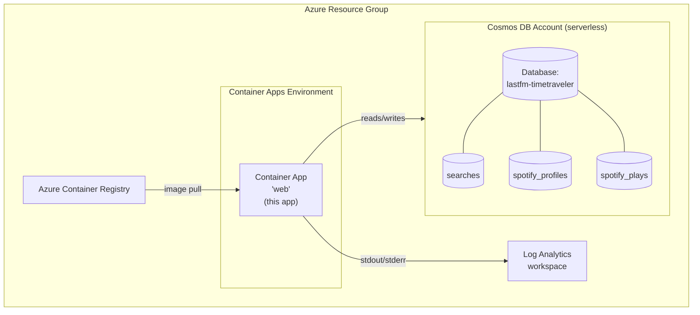

# 🕰️🧑‍🚀 Last.fm Time Traveler

Find the very first time you listened to any song — using your **Last.fm scrobbles**, your uploaded **Spotify Extended Streaming History**, or both.

Connect either source (or both), type a song title, pick from the autocomplete suggestions, and discover when you first played it, plus how many times since.


## What's new

- 🎧 **Spotify import** — upload your Spotify Extended Streaming History (`.json` files or the raw `.zip`) and the app uses your private play data as the **primary** source for first-listen lookups (instant, no API rate limits, complete history back to your first play).
- 🔐 **Token-based auth** — Spotify uploads are protected by a per-profile secret token stored in a cookie. No passwords, no logins. The token's SHA-256 hash is what's stored on the server.
- 🪞 **Dual-source search** — connect Spotify only, Last.fm only, or both. When both are connected, autocomplete merges results and Spotify takes priority (because it's faster and more complete).

## Architecture



The same `database.py` API is used regardless of backend. Backend selection is automatic based on environment variables (see [Database](#database)).

## Setup

1. **Get a Last.fm API key** at https://www.last.fm/api/account/create (only required for Last.fm features; Spotify-only mode works without one for searches over your imported data).

2. **Configure environment**:
   ```bash
   cp .env.example .env
   # Edit .env with your API key
   ```

   Optional settings:
   - `LASTFM_LIBRARY_TIMEZONE` — timezone used when converting scraped Last.fm library dates into unix timestamps (default: `Europe/Vienna`).
   - `DB_PATH` — SQLite file path (default: `timetraveler.db`).
   - `COSMOS_CONNECTION_STRING` *(or `COSMOS_ENDPOINT` + `COSMOS_KEY`)* — switch persistence to Azure Cosmos DB.
   - `COSMOS_DATABASE_NAME` / `COSMOS_CONTAINER_NAME` — override default Cosmos names.
   - `SPOTIFY_BULK_INSERT_WORKERS` — parallelism when bulk-inserting Spotify plays into Cosmos (default: `16`).

3. **Install & run**:
   ```bash
   python -m venv .venv
   source .venv/bin/activate   # Windows: .venv\Scripts\activate
   pip install -r requirements.txt
   python app.py
   ```

4. Open http://localhost:5000

### Dev Container

Open this repo in VS Code with the Dev Containers extension — it will auto-create the venv and install dependencies.

### Running tests

```bash
make test
```

or directly:

```bash
pytest
```

## Spotify import

### How to get your data

1. Log into https://www.spotify.com/account/privacy and request your **Extended Streaming History** (not the basic one — the extended export contains every play back to account creation, with full track metadata and play timestamps).
2. Spotify emails you a download link within ~5 days. The download is a `.zip` containing one or more `Streaming_History_Audio_*.json` files.
3. In the app, enter a display name (anything memorable — it's only used to label your data), then either drop the whole `.zip` in or select the individual `.json` files. Up to 500 MB per upload.

### What gets imported

Each play in the export becomes one row, after filtering:

- **Music only** — podcasts and audiobooks (where `master_metadata_track_name` is null) are skipped.
- **30-second minimum** — plays under 30 s are skipped, matching Spotify's own counting threshold. The "filtered" number you see after upload is the count of plays excluded for these reasons.
- **Re-uploads are deduplicated** — a deterministic per-play ID means uploading the same file twice doesn't create duplicates.

### How lookup works with both sources



### Disconnecting

The "Clear & disconnect" button calls `DELETE /api/spotify/data?delete_profile=true`, which:

- removes every play document from `spotify_plays` (all data for your `profile_id`),
- removes your profile record from `spotify_profiles` (token hash + metadata).

Both Cosmos containers are fully cleaned. There is no recovery once disconnected — your token cookie is also discarded.

## Database

The app supports two persistence modes, chosen automatically:



| Cosmos container | Partition key | Holds |
|---|---|---|
| `searches` | `/username_normalized` | Last.fm first-listen cache + per-artist first-listen cache |
| `spotify_profiles` | `/profile_id_normalized` | One doc per Spotify user — display name + SHA-256 token hash |
| `spotify_plays` | `/profile_id_normalized` | One doc per Spotify play (deterministic SHA-1 ID for natural dedup) |

Per-user partitioning means every Spotify query is a single-partition lookup — fast and RU-cheap.

To run the Cosmos path locally, start the Azure Cosmos DB emulator in Docker and point the app at it:

```bash
docker pull mcr.microsoft.com/cosmosdb/linux/azure-cosmos-emulator:vnext-preview
docker run -d -p 8081:8081 -p 1234:1234 mcr.microsoft.com/cosmosdb/linux/azure-cosmos-emulator:vnext-preview

export COSMOS_CONNECTION_STRING='AccountEndpoint=http://localhost:8081/;AccountKey=<emulator-key>;'
python app.py
```

The emulator exposes the database endpoint on `http://localhost:8081` and the local data explorer on `http://localhost:1234`. The required containers are created on demand.

## Deploy to Azure

This project includes everything needed to deploy to **Azure Container Apps** using the [Azure Developer CLI (azd)](https://aka.ms/azd).

### Prerequisites

- [Azure CLI](https://learn.microsoft.com/cli/azure/install-azure-cli)
- [Azure Developer CLI (azd)](https://learn.microsoft.com/azure/developer/azure-developer-cli/install-azd)
- An Azure subscription

### One-command deployment

```bash
azd up
```

This single command will:
1. Build and push the Docker image to **Azure Container Registry**
2. Provision all infrastructure (**Container Apps Environment**, **Container App**, **Log Analytics**, **Azure Cosmos DB for NoSQL** with the three containers above)
3. Deploy the application to **Azure Container Apps**

`azd up` is idempotent — re-running it after the Spotify migration just adds the new `spotify_profiles` and `spotify_plays` containers. **No data migration is needed**: existing Last.fm cache data stays untouched.

### Provisioned topology



You will be prompted for:
- `AZURE_ENV_NAME` — a short name for this environment (e.g. `lastfm-prod`)
- `AZURE_LOCATION` — Azure region (e.g. `eastus`)
- `LASTFM_API_KEY` — your Last.fm API key (stored as a secret)

The Cosmos connection string is wired into the Container App as a secret reference — you don't need to set it manually.

The resource group, Container App, Container Apps environment, and Log Analytics workspace names are derived from `AZURE_ENV_NAME`. The Azure Container Registry name also uses `AZURE_ENV_NAME`, with a short stable hash suffix because registry names must be globally unique and alphanumeric.

With `lastfm-timetraveler`, the default app URL will be similar to:

```text
https://ca-lastfm-timetraveler.<managed-environment-suffix>.swedencentral.azurecontainerapps.io
```

### CI/CD with GitHub Actions

The `.github/workflows/azure-aca-deploy.yml` workflow runs `azd provision` and `azd deploy` automatically on every push to `main`.

**Required GitHub repository variables** (`Settings → Secrets and variables → Actions`):

| Name | Kind | Description |
|------|------|-------------|
| `AZURE_CLIENT_ID` | Variable | App registration client ID (for OIDC) |
| `AZURE_TENANT_ID` | Variable | Azure AD tenant ID |
| `AZURE_SUBSCRIPTION_ID` | Variable | Azure subscription ID |
| `AZURE_ENV_NAME` | Variable | azd environment name |
| `AZURE_LOCATION` | Variable | Azure region (e.g. `eastus`) |
| `LASTFM_API_KEY` | **Secret** | Last.fm API key |

To set up federated credentials (OIDC) for the service principal, follow the [azd GitHub Actions guide](https://learn.microsoft.com/azure/developer/azure-developer-cli/configure-devops-pipeline).

[Dependabot](.github/dependabot.yml) is configured to open weekly PRs for pip, Docker, and GitHub Actions dependency updates.

## How it works

- **Autocomplete** — calls Last.fm's `track.search` and/or `/api/spotify/search` (your imported plays) in parallel; results are merged with Spotify hits taking priority.
- **First listen (Last.fm)** — `track.getInfo` for play count, then a public-library HTML scrape for the oldest scrobble; falls back to scanning `user.getRecentTracks` pages backward.
- **First listen (Spotify)** — single partition-keyed Cosmos query (or indexed SQLite lookup): `MIN(played_at_unix)` for `(profile_id, track, artist)`. Always instant.
- **Async lookups** — `/api/first-listen` returns `202` with a `lookup_id`; the client polls `/api/lookup-progress?lookup_id=` for status. Progress lives in an in-memory dict, not the database.
- **Scrape resilience** — public Last.fm HTML page fetches use retry/backoff for transient failures (timeouts, connection errors, `429`, `5xx`).
- **Caching** — confirmed Last.fm lookups are written to the `searches` container/table.
- Built with **Flask** (backend) and vanilla **HTML/CSS/JS** (frontend, single file: [`static/index.html`](static/index.html)).

### Endpoints

| Endpoint | Description |
|---|---|
| `GET /api/status` | Health check — verifies the API key is configured |
| `GET /api/ready` | Readiness probe — tests API key and database connectivity |
| `GET /api/user/validate?username=` | Validates a Last.fm username and returns profile info |
| `GET /api/user/top-tracks?username=&period=` | Top tracks for a user (`7day`, `1month`, `3month`, `6month`, `12month`, `overall`) |
| `GET /api/user/recent-tracks?username=` | Recently scrobbled tracks |
| `GET /api/on-this-day?username=` | What the user listened to on this day 1, 2, 5, and 10 years ago |
| `GET /api/search?q=` | Last.fm autocomplete search (minimum 2 characters) |
| `GET /api/first-listen?track=&artist=&username=&profile_id=` | Find the first scrobble (returns `202` with a `lookup_id` for async polling). Both `username` and `profile_id` are optional but at least one must be provided. |
| `GET /api/lookup-progress?lookup_id=` | Poll progress of an async first-listen lookup |
| `GET /api/artist-image?artist=` | Fetch an image URL for an artist |
| `GET /api/artist-first-listen?artist=&username=&profile_id=` | First time a user heard any track by the given artist |
| `GET /api/history?username=` | All cached first-listen results for the given Last.fm username |
| `GET /api/listening-history?username=&track=&artist=` | Per-week play counts for a track (Last.fm only) |
| `POST /api/spotify/upload` | Multipart upload of `.json` / `.zip` Spotify history files. First upload issues a token. |
| `GET /api/spotify/status?profile_id=` | Verify token and report import stats |
| `DELETE /api/spotify/data?profile_id=&delete_profile=true` | Clear imported plays; with `delete_profile=true` also deletes the profile + token |
| `GET /api/spotify/search?profile_id=&q=` | Autocomplete over the user's imported Spotify tracks |

All `/api/spotify/*` endpoints (except the initial upload that creates a profile) require the `spotify_token` cookie or `X-Spotify-Token` header.
